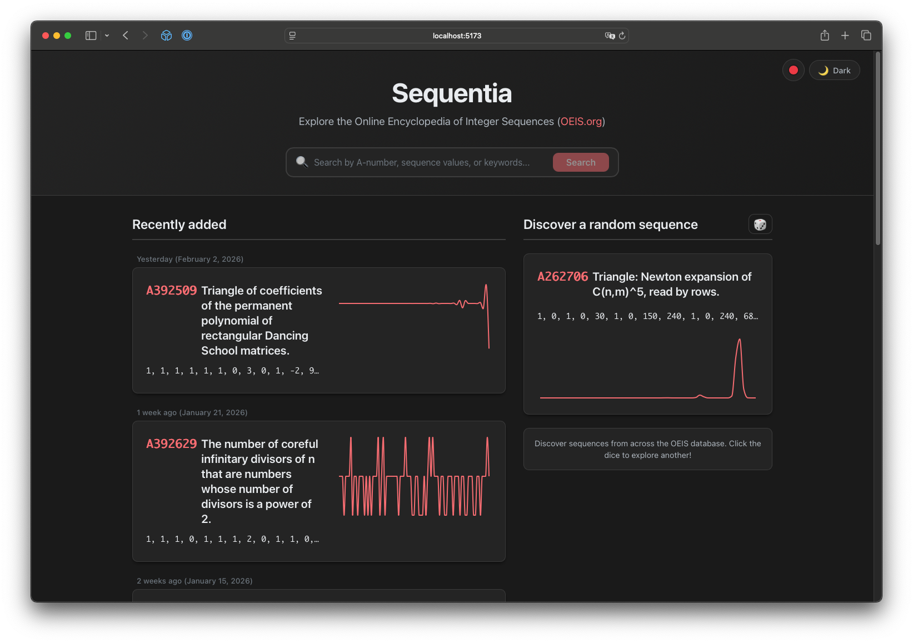
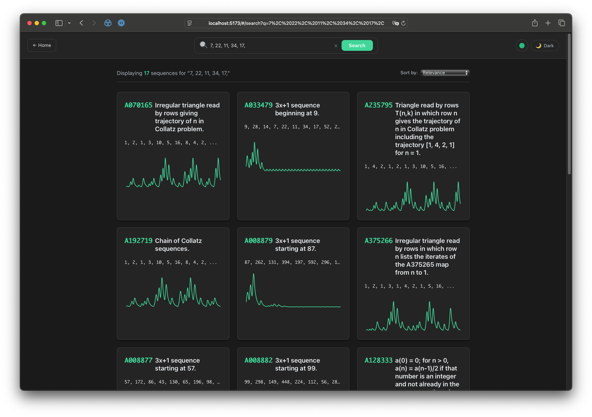
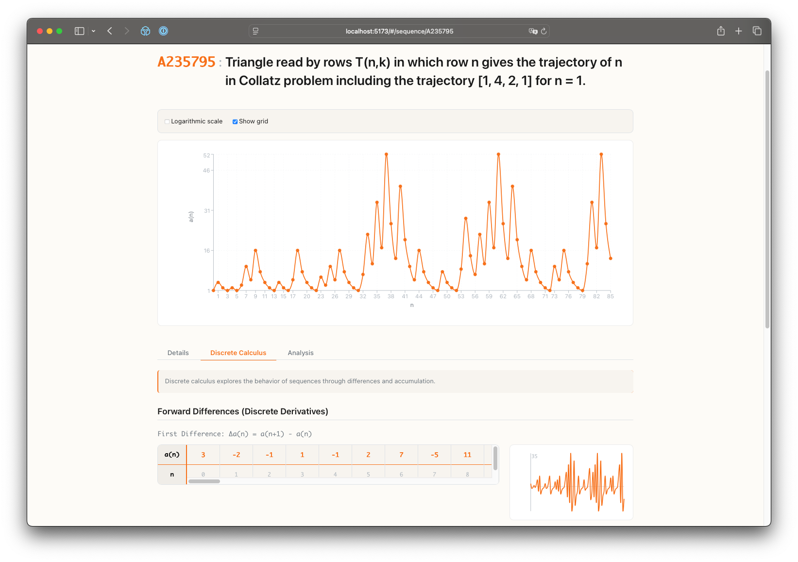

# OEIS Explorer

The [Online Encyclopedia of Integer Sequences](https://oeis.org) is a treasure for math researchers, teachers, students, and enthusiasts.  I've used it for many years as an invaluable tool in research, as well as a way to explore and learn.  However, the website itself is stuck in time.  I believe that interface matters; an enjoyable experience will engage people more, and a bad one may turn people away.

My goal here is to engage people more.  I do so by providing:
* A modern, approachable webpage
* Built-in exploration that is fundamentally visual, via beautiful plotting
    * -->  It's easier to understand what we see!
* Exposure to new sequences by default
    * --> you won't search for something you haven't seen yet, so let's show you something new!
* Built-in analysis tools, like discrete calculus, that automatically searches for matching sequences.
    * --> Did you know that your sequence is actually the derivative of this other sequence that comes from a completely different problem?  Making cross-field connections in math is powerful for research!

